# 使用edu邮箱申请MicroSoft的office365教育版
## ————包括附赠的OneDrive1T容量空间

## 1 前往 www.zzti.edu.cn 学校官网

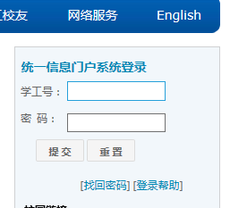

在这里登录。

登录之后页面会跳转到自己的首页

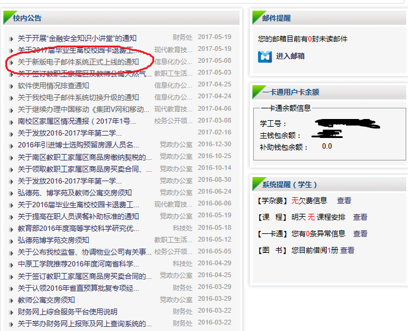

会发现“校内公告”里面有一条通知（我已经标识出来了）

点进去是学校关于邮箱的使用说明。不过，上面只是说了关于邮箱本身的一些说明。比如你的账户名、默认密码之类的。

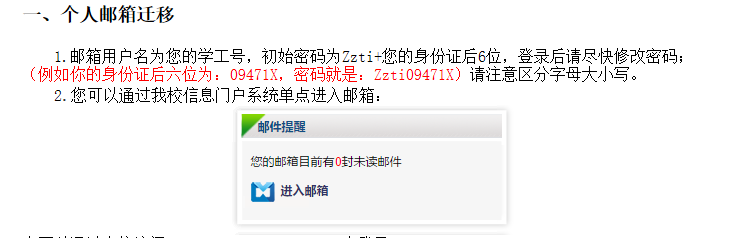

你需要知道的就是这些。里面还有怎样修改邮箱的别名。

默认的邮箱地址是 “学号+@zut.edu.cn”，数字很长而且很难看。所以你可能会想要有个别名。这个公告里面有方法我就不多说了。

## 2 前往微软office官网申请教育邮箱账户

office官网里面这个优惠的链接我是死活找不到，这个链接是在IT之家里面找到的：

[https://products.office.com/en-us/student/office-in-education](https://products.office.com/en-us/student/office-in-education)

自己进去就是了。

首页非常简洁，只有一个输入框。在里面输入edu邮箱地址就OK。

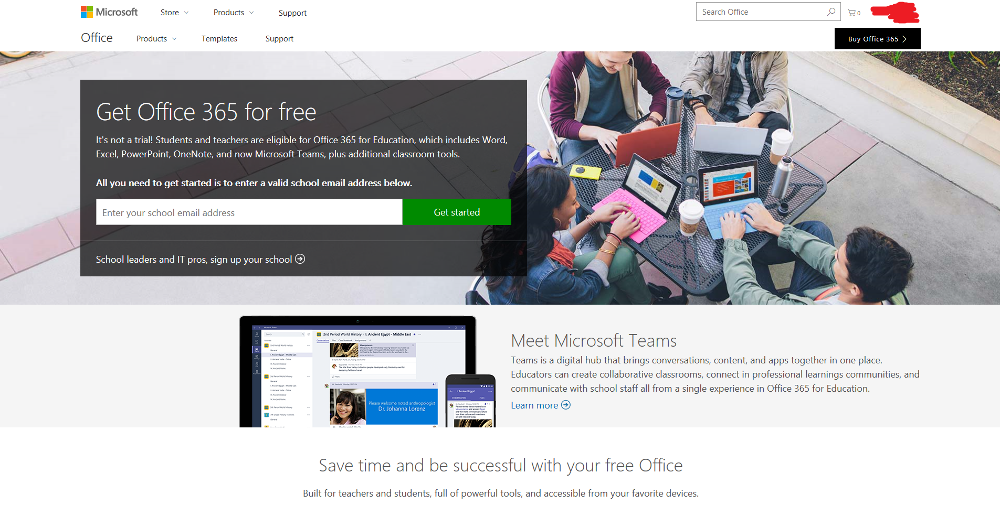

输入你的邮箱进去。

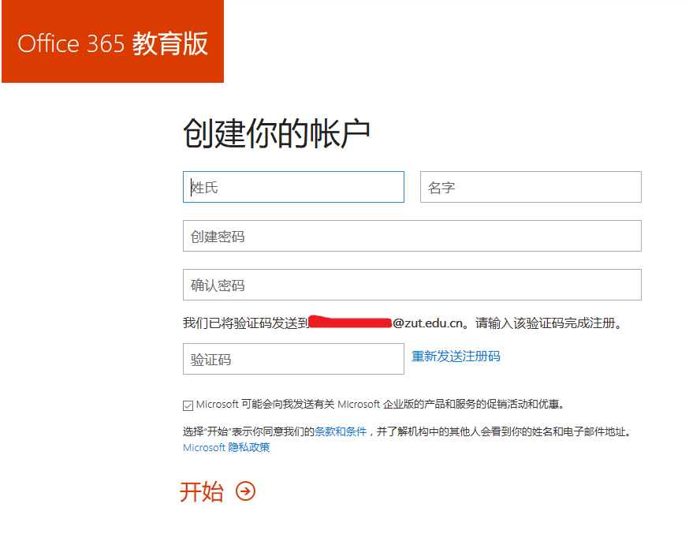

注意这里创建的账户是Office账户。跟EDU邮箱本身已经没有关系了。所以说其实edu邮箱只是起到了一个获得这个优惠的资格的作用。

【我的邮箱已经弄过了，刚刚输入的邮箱是别人的。汗(lll￢ω￢)】

所以这里设置的密码跟EDU的邮箱已经没有关系了，需要你再记住了。

现在去你的edu邮箱的页面，哪里应该已经有一封邮件才对了。

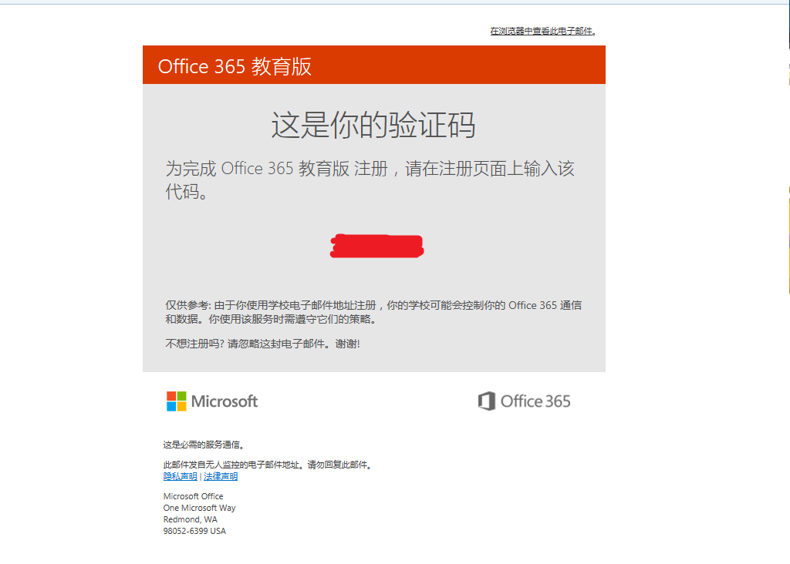

之后会有让你邀请人什么的，也没什么可邀请的，直接跳过就好了。

注册成功后会跳转到office个人主页，里面有你这个账户可以使用的应用，大概是office全家了。

里面有个下载软件的按钮，但是这校园网似乎根本就下不动。暂时没想到好办法。

## 3 使用 office 账户登录 OneDrive 云

用小娜或按 Win+S，输入onedrive，打开OneDrive。

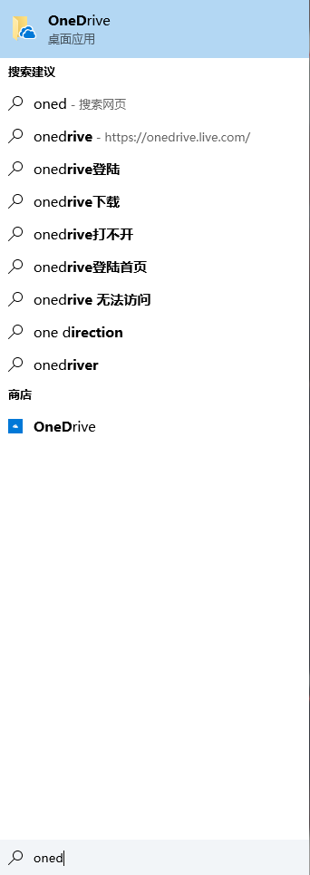

右下角的系统托盘中会有OneDrive的图标。

对这它右键，点击设置。

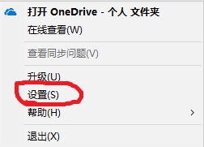

出现如图所示界面

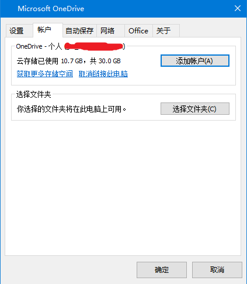

这是我现在以及登录的微软账户，如果你没有登录，也许显示空白吧。

选择“添加账户”，出现下图界面：

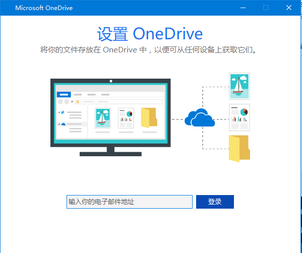

这里输入 *EDU邮箱* 的地址。不过其实是 **Office账户** ，只是名字重复了而已。点击登录，下面会让你输入密码，注意这里的密码是 **Office账户** 的密码，不是你 *EDU邮箱* 的密码。

登录之后就可以了。

下面是此账户的设置界面：

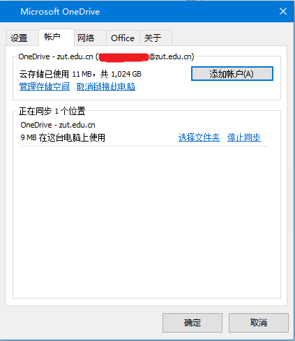

现在按 Win+E 打开 *文件资源管理器*， 应该会有类似下图：

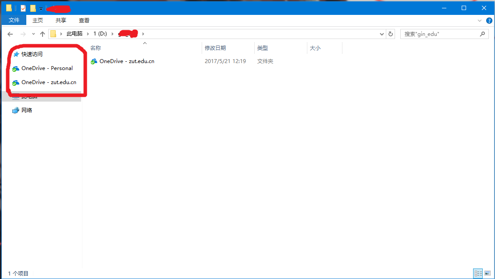

这里有两个账户是因为我登录了两个账户，一个是微软账户，一个是Office赠送容量的账户。

现在，如果你想要上传文件，只需要把文件拖入这里即可。它会自动上传的。没有网络也可以拖入，它会等到有网络的时候自己去同步。如果当前有文件没有同步，那个图标是蓝色的 *√* 标记，现在是绿色表示所以文件都同步完成。

OneDrive的同步非常方便，你使用的时候几乎不会感到它和普通的文件夹有什么不同。而且不像百度，它是没有限速的，不过因为服务器的缘故，确实也算不上快就是了（不同地区可能会有不同）。

## 最后

office365的个人页面有软件下载，这个也许是下载软件的地方，不过我试了试，实在是下不动。所以具体如何也不知道，实在抱歉。用EDU申请office我也是第一次，大家如果网络不错的可以试试。

最后，我晒一下桌面啊→_→
